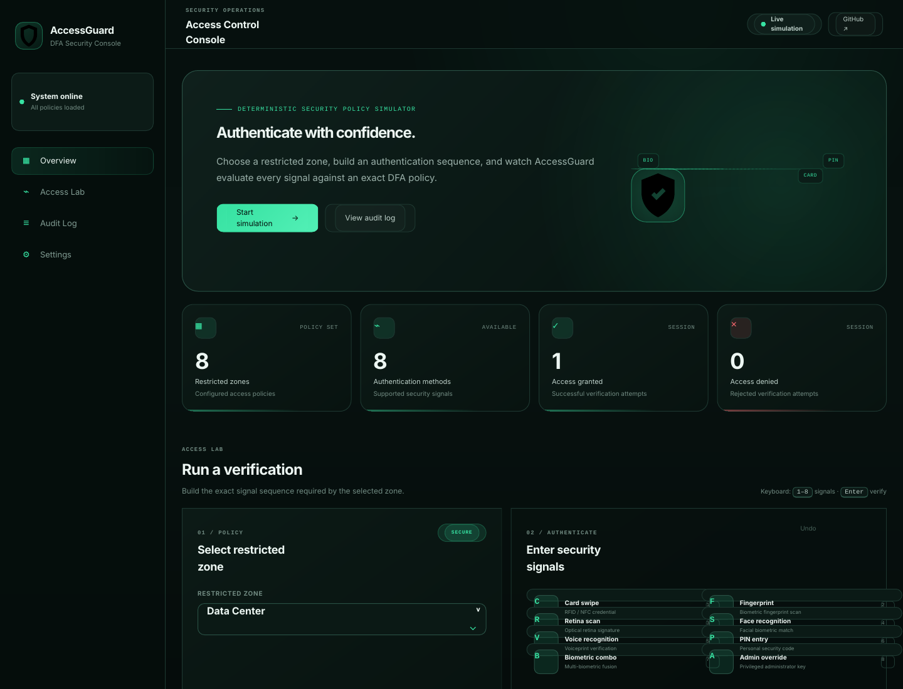
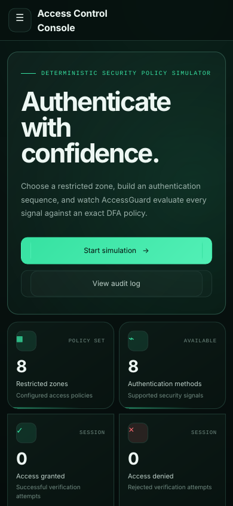

# AccessGuard

A polished **DFA-based smart-building access control simulator** for visualising exact authentication sequences, live state transitions, access decisions, and audit activity.

Built as a frontend portfolio project with a small Python DFA companion module.

## Preview

### Desktop



### Mobile

<p align="center">
  
</p>

## Highlights

- Modern security-operations dashboard UI
- Exact-order DFA authentication validation
- **Live DFA state visualisation** (`q0 → qN`)
- 8 restricted zones with different security policies
- 8 authentication methods
- Success and denial counters
- Audit log with **CSV export**
- Optional local audit persistence with `localStorage`
- Undo, clear, and keyboard shortcuts
- Functional mobile navigation drawer
- Responsive desktop, tablet, and mobile layout
- Compact display mode for smaller screens
- Accessible labels, focus states, and reduced-motion support
- GitHub Pages friendly — no build step required

## Authentication signals

| Code | Method |
| --- | --- |
| `C` | Card swipe |
| `F` | Fingerprint |
| `R` | Retina scan |
| `S` | Face recognition |
| `V` | Voice recognition |
| `P` | PIN entry |
| `B` | Biometric combo |
| `A` | Admin override |

## Example policies

| Zone | Required sequence |
| --- | --- |
| Lobby | `C → F` |
| Server Room | `C → P → R` |
| Laboratory | `C → F → S` |
| Data Center | `C → P → F → R` |
| Admin Office | `C → P → A` |

The simulator accepts a request only when the entered sequence exactly matches the selected zone's required DFA path.

## Keyboard shortcuts

- `1`–`8` — add an authentication signal
- `Enter` — verify access
- `Backspace` — undo the last signal
- `Esc` — clear the current sequence

## Project structure

```text
access-guard/
├── index.html
├── assets/
│   ├── css/
│   │   └── styles.css
│   └── js/
│       └── app.js
├── backend/
│   └── dfa_access_control.py
├── docs/
│   └── ARCHITECTURE.md
├── screenshots/
│   ├── desktop.png
│   └── mobile.png
├── CONTRIBUTING.md
├── LICENSE
├── README.md
└── .gitignore
```

## Run locally

No dependencies are required for the frontend.

### Python server

```bash
python -m http.server 5500
```

Open `http://localhost:5500` in your browser.

### VS Code Live Server

1. Open the project folder in VS Code.
2. Install the **Live Server** extension.
3. Right-click `index.html`.
4. Choose **Open with Live Server**.

## Python DFA companion

You can also test the core DFA policy from the terminal:

```bash
python backend/dfa_access_control.py
```

## GitHub Pages deployment

1. Push the project to a GitHub repository.
2. Open **Settings → Pages**.
3. Choose **Deploy from a branch**.
4. Select `main` and `/ (root)`.
5. Save and wait for deployment.

## Technology

- HTML5
- CSS3
- Vanilla JavaScript
- Browser `localStorage`
- Python 3 (optional DFA companion)

## Author

- GitHub: **shawn-cse**
- Email: **shawnazd@gmail.com**

## License

Licensed under the [MIT License](LICENSE).
